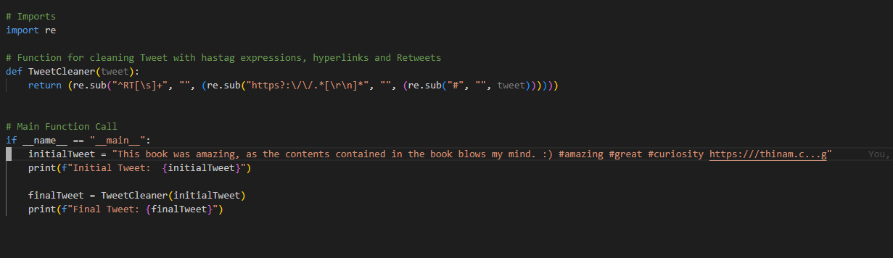
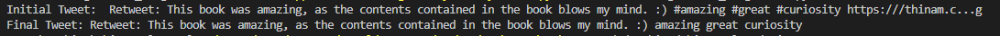
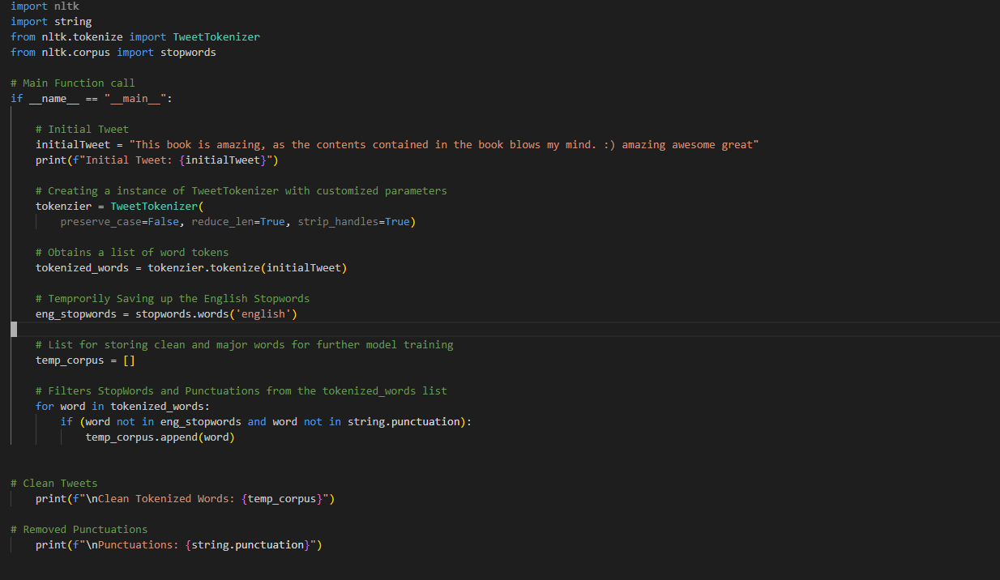
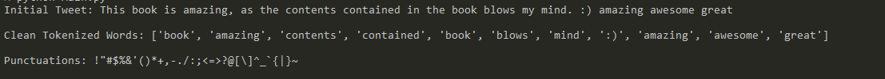

<h1>Journey for my 66 Days for NLP </h1>

    Currently at the start point for learning Natural Language Processing. With this, i will
    set my path for achieving a small degree of knowledge in NLP and Data Science.  

    Paticularly following a friend's path #Thinam 

<strong>Day 1 of 66DaysOfNLP</strong>

<ul>
<l1>
    NLP or Natural Language Processing can simply be regarded as a field in Artificial Intelligence
    that focuses on the processing and indepth analyzing of Natural Language Data that sums up conversations between Human to Computers as well as Human to Human. 

In the following snapshot, I have displayed today's work progress that showcases trimming of certain text
by using a normal Python Library i.e. Regex. It is a simple program that removes Hashtag expressions, Retweet Text and hyperlinks from the input text and prints it out. 

</li>
</ul>

<strong>Day 2 of 66DaysOfNLP</strong>

<ul>
<l1>
I would consider String Tokenization as one of the most crucial part while working with traditional NLP models or Advanced Deep Learning Models. The basic concept is to dissect a text or a string into tokens in the form of words or characters or sub words. With this we also have to remove stop words and punctuations as it doesn't add much value for the text.

In today's snapshot I have demonstrated the working of a Word Tokenizer which is one of the most commonly used tokenizer among Character and Sub Word Tokenizer. However, Words Tokenizer will suffer some problems while working with unknown tokens or word as compared to other types. I have implemented the Tokenizer to generate a list of clean word tokens or tweets from a given text string. 

</li>
</ul>

<strong>Day 3 of 66DaysOfNLP</strong>

<ul>
<l1>
    On the third day, I have learned about the Stemming process in Natural Language Processing. In simple terms, it can be described as the process of stripping down a word to its most basic form by removing its suffix. It plays a vital role in minimizing the vocabulary size of our datasets. 

        In the snapshot provided below, I have utilized three variants of Stemmer's provided by the NLTK library i.e. Porter, Snowball and Lancaster. Porter Stemmer being the least aggresive stemmer has a less accurate output compared to other two stemmers. Lancaster Stemmer tends to have a aggressive approach which will significantly trim down the word and reduce your vocabulary. 
</li>
</ul>

